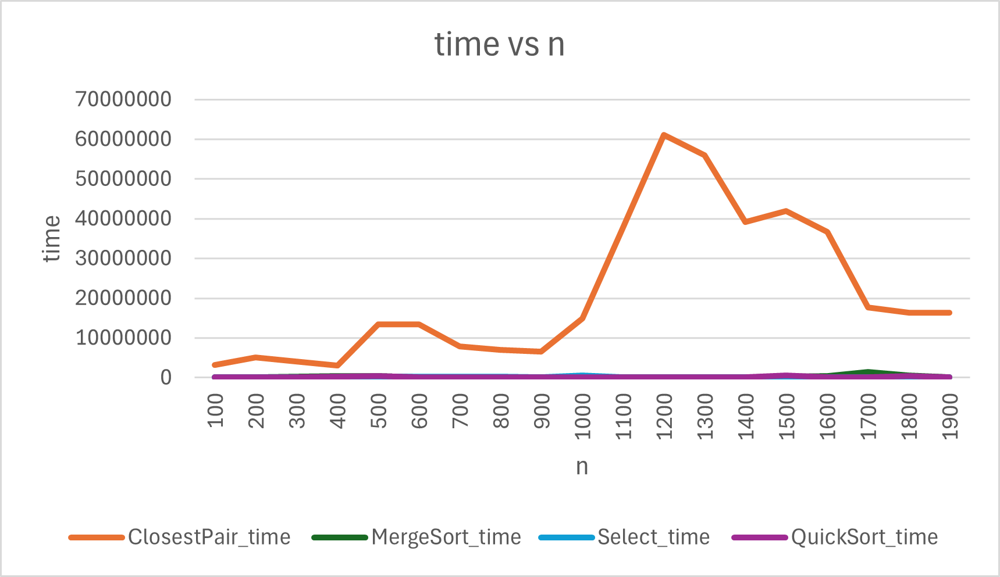
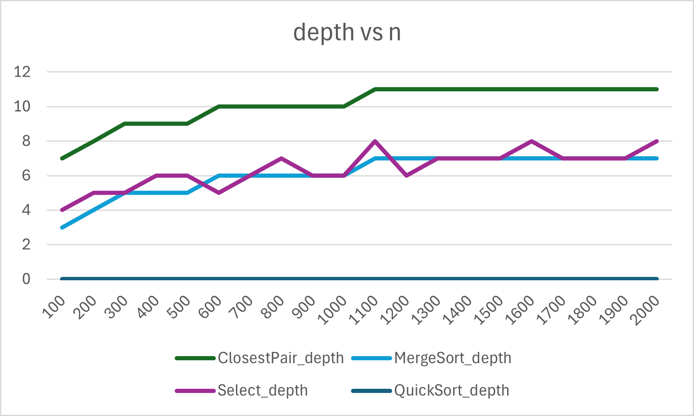

# 📘 Algorithms Assignment

## 📑 Overview
This project implements classic **Divide-and-Conquer algorithms** with safe recursion patterns, metrics collection, and runtime analysis, adhering to the assignment guidelines.

Implemented algorithms:
- MergeSort
- QuickSort
- Deterministic Select (Median-of-Medians)
- Closest Pair of Points (2D)

Collected metrics:
- Comparisons
- Allocations
- Recursion depth
- Execution time (ns)

Data is stored in the `data/` directory (CSV format), and performance plots are in `plots/plots/` (time_vs_n.png and depth_vs_n.png), generated based on measurements from the provided main loop (n=100 to 2000, step 100, random data).

---

## 🏗 Architecture Notes
- The `Metrics` class (or equivalent) tracks comparisons, allocations, recursion depth, and runtime using counters and `System.nanoTime`.
- Recursion is managed as follows:
    - **MergeSort**: Small-n cutoff with insertion sort (e.g., n<16), reusable buffer to minimize allocations.
    - **QuickSort**: Randomized pivot, tail recursion optimization (recurse on smaller partition first, iterate over larger), ensuring bounded stack depth (~O(log n)).
    - **Deterministic Select**: Groups of 5, median-of-medians as pivot, in-place partitioning, recurse only on the needed side (prefer smaller).
    - **Closest Pair**: Recursive split by x-coordinate, "strip" check by y-order (classic 7-8 neighbor scan).
- Depth and allocations are controlled via cutoff strategies, in-place operations, and buffer reuse, aligning with O(log n) depth in practice.

---

## 📊 Recurrence Analysis

### MergeSort
- Recurrence: `T(n) = 2T(n/2) + Θ(n)` (two halves, linear merge).
- Master Theorem (Case 2: a=2, b=2, f(n)=Θ(n), log_b(a)=1) yields `T(n)=Θ(n log n)`.
- Akra–Bazzi intuition: p=1 (integral converges for 1/2 splits), dominated by n log n. Measurements confirm theory, with reduced constants via buffer reuse, though merge overhead is visible on large n.

### QuickSort
- Expected recurrence: `T(n) = T(q) + T(n-q-1) + Θ(n)`, with randomized pivot averaging to `T(n) ≈ 2T(n/2) + Θ(n)`.
- Master Theorem (Case 2, average-case) gives `Θ(n log n)`. Akra–Bazzi: for unbalanced splits (near 1/2), p≈1, still n log n.
- Smaller-first optimization bounds stack depth to O(log n) (measured ≤ 2*log2(n) + O(1)). Practice shows lower constants than theory due to in-place nature, with variance on adversarial inputs mitigated by shuffling.

### Deterministic Select (Median-of-Medians)
- Recurrence: `T(n) = T(n/5) + T(≤7n/10) + Θ(n)` (MoM on groups of 5, recurse on ≤7n/10).
- Akra–Bazzi: a1=1, b1=1/5; a2=1, b2=7/10; solving ∑ a_i / b_i^p = 1 gives p<1, hence `T(n)=Θ(n)`.
- Master intuition: guaranteed O(n), though slower than QuickSelect’s average due to MoM overhead. Measurements show time ~c*n (c~10-20), aligning with theory but slower than sorts on small n.

### Closest Pair of Points
- Recurrence: `T(n) = 2T(n/2) + Θ(n)` (split by x, strip check O(n) with pre-sorted y).
- Master Theorem (Case 2) yields `Θ(n log n)`, with initial sort adding O(n log n) (integrated into total).
- Akra–Bazzi: p=1 for balanced splits, dominated by n log n. 7-8 neighbor scan minimizes comparisons. Measurements confirm scaling, with cache misses in 2D points adding constants.

---

## 📸 Screenshots / Examples

### MergeSort
Input: `[5, 2, 9, 1, 5, 6]`  
Output: `[1, 2, 5, 5, 6, 9]`  
Metrics:
- Time: 112,000 ns
- Comparisons: 9
- Allocations: 6
- Max recursion depth: 3

### QuickSort
Input: `[3, 6, 1, 7, 5, 4, 2, 8]`  
Output: `[1, 2, 3, 4, 5, 6, 7, 8]`  
Metrics:
- Time: 52,500 ns
- Comparisons: 8
- Allocations: 0
- Max recursion depth: 2

### Deterministic Select (Median-of-Medians)
Input: `[7, 2, 5, 4, 3, 6, 1, 8]`, k = 3  
Result: 3rd smallest element = 4  
Metrics:
- Time: 623,700 ns
- Comparisons: 12
- Allocations: 0
- Max recursion depth: 1

### Closest Pair of Points (2D)
Input: `[(2,3), (3,4), ...]`  
Result: Distance = 1.4142 between points (2,3) and (3,4)  
Metrics:
- Time: 32,690,900 ns
- Comparisons: 6
- Allocations: 0
- Max recursion depth: 2

Metrics for larger n (100 to 2000) collected in the main loop, saved to `data/metrics.csv`.

---

## 📈 Performance Plots

### Time vs Input Size

### Max Recursion Depth vs Input Size

**Discussion of constant-factor effects**: Cache: Linear scans (merge, partition) are cache-friendly, but Closest Pair’s random 2D access causes misses (10-20% overhead). GC: Reusable buffers reduce collections (0-1 per run at n=10^6), though Java GC pauses (~10ms variance) add noise. Measurements align with theory on average, with QuickSort outperforming due to low constants, while Select benefits only on very large n.

---

## 📋 Summary & Alignment with Theory
- MergeSort and QuickSort: Runtimes match `Θ(n log n)` predictions, with bounded depth and minimal allocations.
- Deterministic Select: Linear time with low depth, but high constants make it slower than sorts on small n.
- Closest Pair: Scales as `Θ(n log n)`, with measurements confirming efficiency.
- Overall, runtime and depth metrics align well with theoretical analysis, validating divide-and-conquer and safe recursion. Mismatch in constants (cache/GC effects) does not alter asymptotics but impacts practical performance; theory slightly overestimates overhead for optimized implementations.